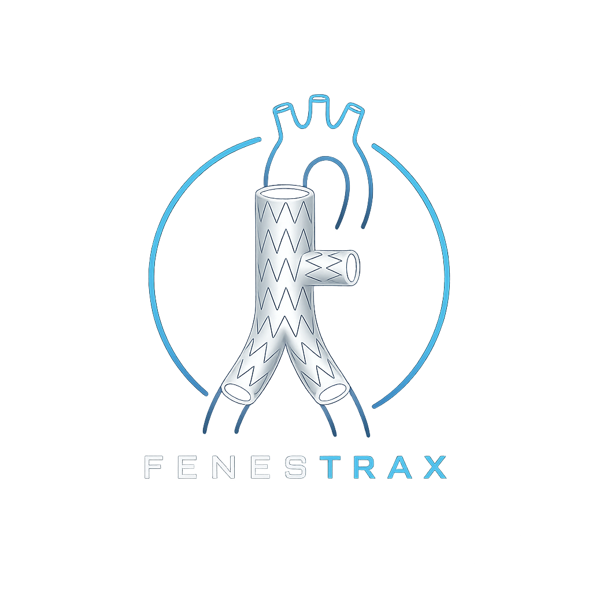
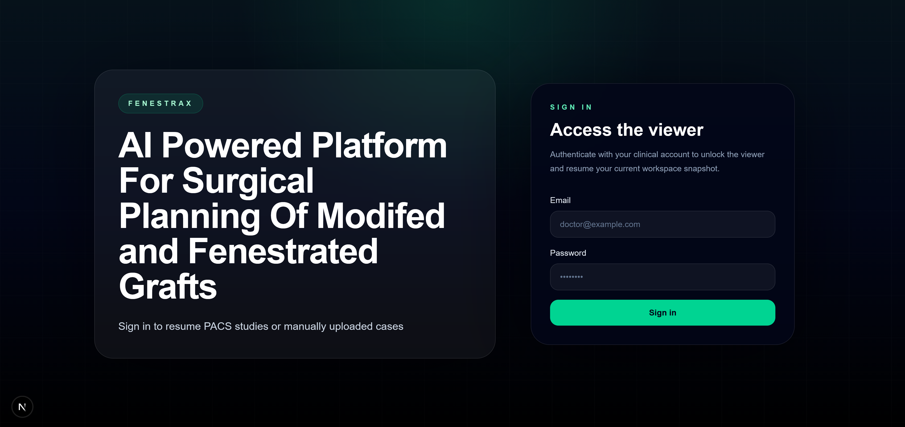
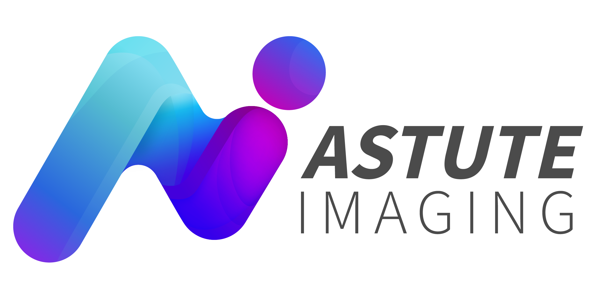
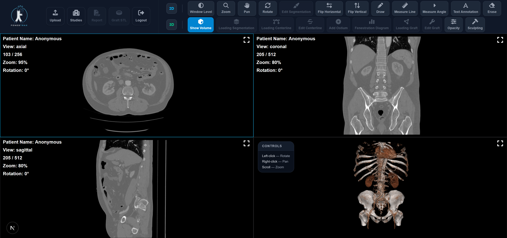
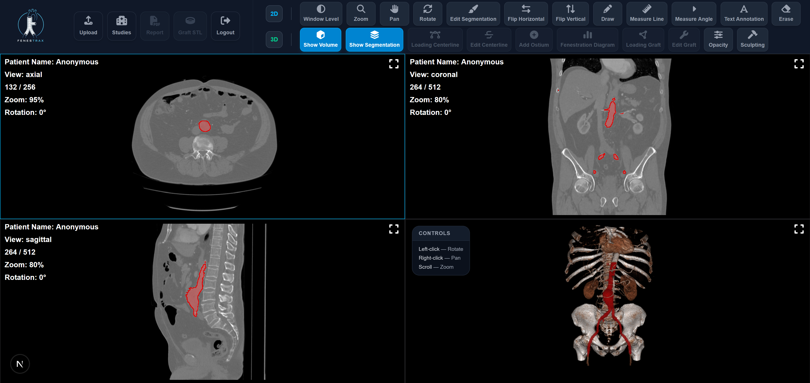
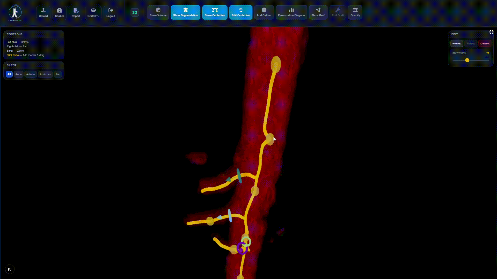
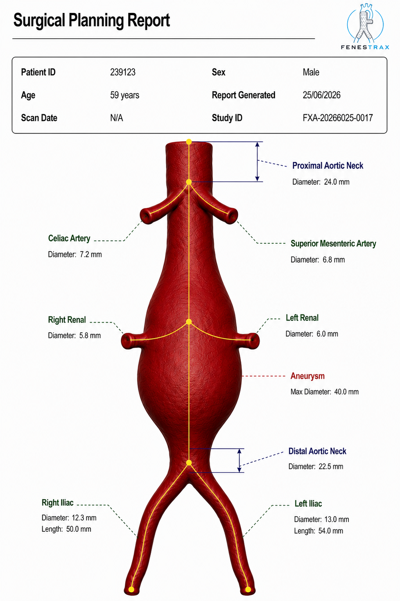

<h1 align="center">
  <picture>
    <source
      srcset="./screenshots/fenestrax_logo_light.png"
      media="(prefers-color-scheme: light)"
    />
    <source
      srcset="./screenshots/fenestrax_logo.png"
      media="(prefers-color-scheme: dark)"
    />
    
  </picture>
</h1>

## Description

- **Surgical planning platform** for designing customized grafts used to **treat aortic aneurysms**, helping surgeons plan complex procedures for a disease responsible for **more than 150,000 deaths worldwide each year**.

- **Reduces preoperative planning time by over 80%** by using AI and geometric analysis techniques.

- **Includes interactive editing tools** that enable surgeons to refine and validate the automated measurements, **ensuring clinically accurate treatment plan**.

## Supervision

<table>
<tr>
<td width="80%">

This plaltform was developed under the supervision of **Astute Imaging**, whose team **provided continuous technical guidance and clinical feedback** throughout the development process.

</td>
<td align="center" width="20%">

</td>
</tr>
</table>

## Tech Stack Used

| **Frontend**   |     |
| -------------- | ---------------------------------------------------------------------------------------------------------------------------------------------------------------------------------------------------------------------------------------------------------------------------------------------------------------------------------------------- |
| **Styling**    |                                                                                                                                                                        |
| **Backend**    |                                                                                                                                                                                                                                                                  |
| **AI Model**   |                                                                                                                                                                                                                                                       |
| **Database**   |                                                                                                                                                     |
| **Deployment** |                                                                                                                                     |

## Features

- **Multi-Planar Reconstruction** of CT scan in 2D & 3D views

- **Flexible Input Parsing** of different formats **(DICOM, NRRD, NIFTI)**

- **Measurement & Annotation Tools** for 2D views

- **Interactive 2D Manipulation** including zooming, panning, rotating, and **synchronized brightness and contrast manipulation**

- **Interactive 3D Manipulation** including changing the opacity for better visualization of the arteries

- **Automatic Segmentation** of aorta and arteries with **Dice Score 0.88** utilizing a deep learning model **trained on 52,000 axial slices**

- **Segmentation Editing** for surgeons to manually verify the aorta and arteries regions

- **Automatic Centerline Extraction & Labelling** which allows automatic localization of branching arteries openings

- **Centerline Editing** for surgeons to manually verify the center points of the aorta and arteries

- **Surgical Planning Report Generation** as an exportable **PDF report** containing the automated measurements and surgeon modifications, enabling **easy sharing and documentation** of the final surgical plan.

## Acknowledgement

We would like to express our sincere gratitude to our project supervisors:

| Name                         | Position                                                                                               | LinkedIn                                                                                                                                                              |
| ---------------------------- | ------------------------------------------------------------------------------------------------------ | --------------------------------------------------------------------------------------------------------------------------------------------------------------------- |
| **Prof. Ahmed Ehab Mahmoud** | COO & Co-Founder, Astute Imaging Faculty Member, Systems & Biomedical Engineering, Cairo University |                |
| **Dr. Manar Nasser**         | Product Manager, Astute Imaging                                                                        |  |

Their invaluable guidance, continuous support, insightful feedback, and encouragement throughout this project have been instrumental in its success. We deeply appreciate the time, expertise, and dedication they devoted to helping us achieve our goals.

## Team Members

| Name              | GitHub                                                                                                                           | LinkedIn                                                                                                                                                                |
| ----------------- | -------------------------------------------------------------------------------------------------------------------------------- | ----------------------------------------------------------------------------------------------------------------------------------------------------------------------- |
| Mostafa Ayman     |  |           |
| Louai Khaled      |           |               |
| Ali Younis        |        |         |
| Zeyad Amr         |       |          |
| Abdelrahman Sayed |  |  |
